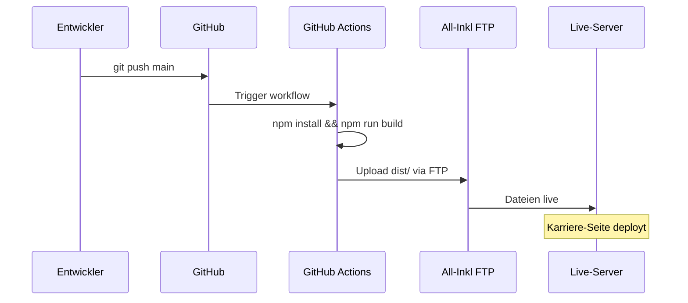
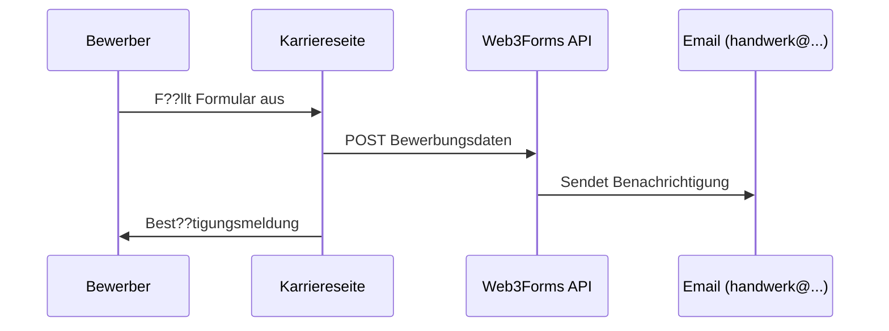

# Key flows

## Deployment-Pipeline



## Bewerbungsprozess (Karriereseite)



## Migration Live ??? Neu

```mermaid
sequenceDiagram
    participant Alt as ebit.at (FirmenABC)
    participant DNS as Domain-Registrar
    participant Neu as All-Inkl
    participant Email as M365 / All-Inkl

    Note over Alt,Email: Phase 1: Vorbereitung
    Alt->>DNS: Auth-Code f??r Domain-Transfer
    Email->>Email: IMAP-Migration M365 -> All-Inkl

    Note over Alt,Email: Phase 2: Umschaltung
    DNS->>Neu: Nameserver auf All-Inkl ??ndern
    Neu->>Neu: Website live schalten

    Note over Alt,Email: Phase 3: Altsystem
    Alt->>Alt: ebit.at Hosting deaktivieren
    Email->>Email: M365 deaktivieren
```
